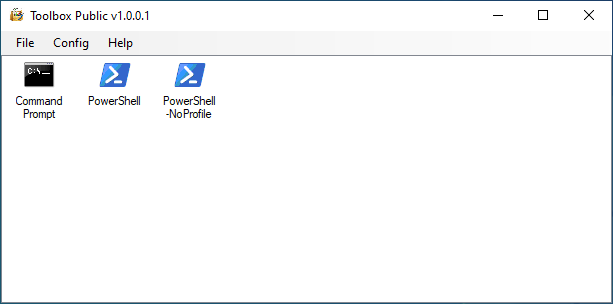

# Description

Toolbox is a PowerShell based Windows Form tool developed using Sapien PowerShell Studio 5.8.196.
This repo contains the PowerShell Studio project files along with a PS1 export and a x86 and x64 compiled executable of the project.

Toolbox was designed with the intent of being used in a Windows domain to assist with the implementation of least privilege. Essentially
one logs into their workstation using a standard user login (that doesn't have elevated permissions to any systems) and then launches the
Toolbox using the 'Run as different user' option with a administrative ID. From there you can create shortcuts within Toolbox that point to
items you want to launch using the administrative ID that you launched Toolbox as. From that point on you enter your administrative ID credentials
once to launch Toolbox and then don't have to enter the credentials again.

Below is a screenshot of Toolbox setup with a Command Prompt and two PowerShell shortcuts:

# Change Log
**v1.0.0.0 (05/23/2017)**
* Initial public release of Toolbox.

**v1.0.0.1 (12/15/2021)**
* Cleaned up the project to remove references to components that were removed in the public release.
* Changed the listview object so that it takes up the entire window.
* Rebranded 'Custom Tools' within Toolbox to 'Shortcuts'.
* Cleaned up logging entries.
* Updated Toolbox to storing shortcuts at launch as an array of objects instead of a datatable object.
* When Toolbox is launched as an Administrator it now prefixes 'Administrator:' to the text in the title bar of Toolbox.
* When Toolbox is not launched as an Administrator there is a right click context menu option to launch any shortcut as an Administrator.
* Added the ability to configure shortcuts to always run as an Administrator when the Toolbox hasn't been launched as an Administrator.

# Usage - Creating shortcuts

Once Toolbox is launched you can create new shortcuts within Toolbox by right clicking within the window and selecting 'New Shortcut', or by clicking 'File -> New Shortcut'.
In the 'New Shortcut' window you'll specify the following:
* Name: The name of the shortcut. Can be anything, however must be unique compared to other shortcut names in your Toolbox.
* Execute: What you want the shortcut to launch. Will typically be an executable.
* Arguments: Any arguments you want to pass along with the execute statement.
* Run as Admin: If this box is checked and the Toolbox tool was launched using the 'Run as different user' method, clicking the shortcut will result in a UAC prompt.
* Icon: The icon to be shown with the shortcut in the Toolbox. By default Toolbox will use the icon of the item you specify for the Execute parameter.

**New Shortcut Example 1:**\
Name: Command Prompt\
Execute: C:\Windows\System32\cmd.exe\
Arguments:\
Run as Admin: False
	
The above will result in a shortcut called 'Command Prompt' in the Toolbox that when launched will not force a UAC prompt.
	
**New Shortcut Example 2:**\
Name: Command Prompt (RunAs)\
Execute: C:\Windows\System32\cmd.exe\
Arguments:\
Run as Admin: True
	
The above will result in a shortcut called 'Command Prompt (RunAs)' in the Toolbox that when launched will force a UAC prompt. If the Toolbox was launched using the
'Run as different user' option and the user that you ran the Toolbox as if in the local Administrators group on the system, then you should get a simple 'Yes/No' UAC prompt.
If the user you launched the Toolbox as is not in the local Administrators group on the system then you will get a credential input UAC prompt.
	
**New Shortcut Example 3:**\
Name: PowerShell -NoProfile\
Execute: C:\Windows\System32\WindowsPowerShell\v1.0\powershell.exe\
Arguments: -noprofile\
Run as Admin: False
	
The above will result in a shortcut called 'PowerShell -NoProfile' in the Toolbox that when launched will not force a UAC prompt. Additionally with the -noprofile argument
the PowerShell prompt opened will not use any profiles.
	
# Usage - Removing shortcuts

Once Toolbox is launched you can remove shortcuts by right clicking any shortcut in the window and selecting 'Remove Shortcut'. After confirming, the shortcut is removed.

# Under the hood

Toolbox has some basic logging that writes to 'C:\Temp\intrntpirate\Logs'. The log file name is the username running Toolbox. If you want more verbose logging to occur you can enable
debug mode from the 'Help' menu in Toolbox.

Toolbox stores its configuration under the registry key HKCU:\Software\intrntpirate\Toolbox. If you look at the top of MainForm.psf in the project you will see variables that have their
default value statically defined, however these values can be overridden by creating string values in the 'Toolbox' registry key. The only exception to this are some variables that are
"locked" under the 'Get-LockedConfigItems' function in MainForm.psf.

The shortcuts displayed in the Toolbox are also stored under the Toolbox key. You'll find them located under the 'Shortcuts' key with a key created for each shortcut. Within each key
are string values for the properties that make up the shortcut. If you wanted to you could use Group Policy or something else to automatically create these registry entries to pre-populate the Toolbox
for users based on group memberships or something else.
